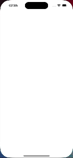

# 🏗️ Busha Interview Task

### ▶️ Demo Showcase

> [!NOTE]
> Project runs on flutter version 3.24.3

### 📚 Description

The project is a simple implementation of Busha's interview task. It involves a user logging in to
view the dashboard before checking transactions on the block chain. To get the login working, we
allow users to sign up, we save the user's sign up information in the local storage to allow for
login across application sessions.

API integrations were done to blockchain API to get latest block for the bitcoin blockchain and we
connect to Tezos to get the latest blocks for the Tezos blockchain.

> [!NOTE]
> The API for Tezos is not working as expected, so the data is not being displayed

### ☄️ Running

You can run the project locally if you pull the repository and have flutter installed or you can
download any of the 2 apk files in the submission folder and install on your android device.

> [!NOTE]
> Please try the arm64-v8a apk first before trying the armeabi-v7a apk in case of compatibility
> issues.

### 🏷️ Project features

- Authentication
- Dashboard
- Transactions
- Unit tests for view models
- Integration tests

### 🥸 Author

Sebastine
Odeh 